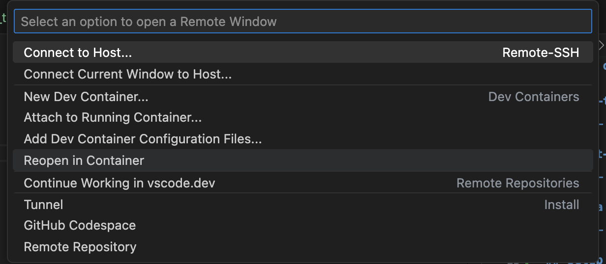

# demo-testing-ml
Repository to show case simple and minimal testing of ML systems part of demo for KaggleX

## Type of tests
Below follows a quick overview of some of the tests in this repo, for more details see this [blog post](https://dswithmac.com/posts/testing-ml/)

### Pre-training tests
These type of tests are used as different *sanity checks* to identify bugs early on in the development process of a ML system.

Some example tests, with examples here (✅):
1. Check shape of model output ✅
2. Check shape of model input ✅
3. Check output ranges ✅
4. Make assertions on your dataset
5. Check for data leakage between your datasets ✅

### Post-training tests
These type of tests do normally fall into two different groups: invariance tests & directional expectation tests

Some example tests, with examples here (✅):
1. Assert that model output consistent to small changes in a feature of interest :check:

### Data drift tests
Tests to check for potential drift in input data, some tests to consider:
1. T-test
2. Kolmogorov-Smirnov test ✅
3. Kullback–Leibler divergence

## Local Setup
1. Install [vs-code](https://code.visualstudio.com/download)
2. Install the [dev-containers](https://code.visualstudio.com/docs/devcontainers/tutorial) extension
3. Use the `DockerFile` in this repository and `Re-open` as the container: 


## Running tests
To run all tests in this repository run the below in the `dev-container`:
```sh
python -m pytest --disable-pytest-warnings src/ --no-header -v
```